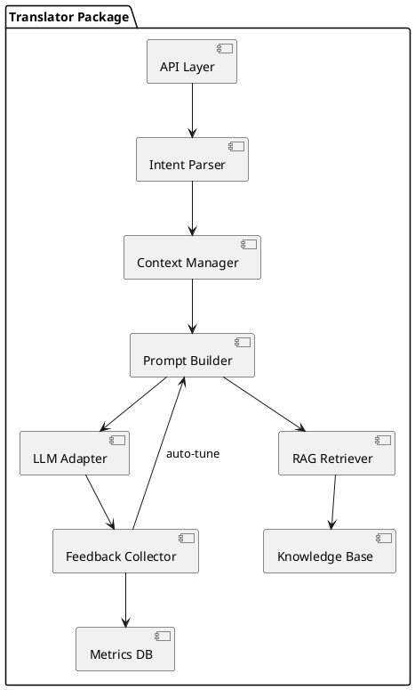

# H2M - Human-to-LLM-Translator

## Background

H2M "Human-to-LLM Translator" is a developer-facing software package that serves as a bridge between human input and large language model (LLM) systems.
As an installable library or microservice, it abstracts prompt engineering complexity by transforming plain-language intent definitions into optimized, structured prompts.  Developers embedding LLM capabilities into their applications simply invoke the Translator API or SDK with high‑level instructions.

Key package goals:

* Provide a clear, extensible API for intent specification, context enrichment, and response handling.
* Support multiple LLM backends interchangeably, including on‑premise and cloud providers.
* Offer plugin points for custom data sources, prompt templates, and feedback analyzers.
* Ensure prompt and inference efficiency through caching, compression, and dynamic parameter tuning.

## Requirements

Below are cutting-edge capabilities brainstormed for H2M, prioritized using MoSCoW:

**Must Have**

* Retrieval-Augmented Generation (RAG): Integrate real-time document and knowledge-base retrieval to ground outputs if they exist.
* Prompt performance feedback loop: Collect model response metrics and auto-tune prompt templates.
* Prompt efficiency optimization: Automatically compress and optimize prompts to minimize token usage and reduce cost and latency, including template caching and reuse.
* Dynamic context injection: Automatically pull relevant user, domain, and session data to enrich prompts at runtime.
* Adaptive Tokenization: Dynamically adjust tokenization strategies in real-time depending on context to optimize token efficiency, reduce costs, and enhance accuracy.

**Should Have**

* Multimodal input support: Allow plain-language definitions to include but not limited to images, audio, or structured data references to achieve richer and contextually deeper AI interactions.
* Adaptive persona switching: Translate intents into different model personas or tones based on use-case metadata.
* Version control integration: Track prompt template versions and allow rollbacks or A/B testing.
* API hooks and function calling: Detect developer-specified actions and embed function-calling instructions into prompts.
* Adversarial prompt resilience: Detect and mitigate potential prompt injections or manipulations.

**Could Have**

* Chain-of-thought augmentation: Automatically insert reasoning steps or reflection prompts to improve model transparency.
* Full on-device inference translation: Running the translation and fine-tuning layer offline on edge devices.
* Self-hosted parameter tuning: Complete isolation from cloud-based telemetry or analytics.
* Dynamic Fine-Tuning on Edge Devices: Enable selective, incremental fine-tuning of small model components directly on resource-constrained edge devices to empower personalized LLM experiences without constant cloud communication.

**Won’t Have (for MVP)**

* Automated ethical bias mitigation pipelines at runtime

## Open-Source Components

To accelerate development and leverage community-tested tooling, the following OSS libraries and frameworks are recommended:

* **API Layer**: [FastAPI](https://github.com/tiangolo/fastapi) for high-performance REST/GRPC endpoints, auto-generated docs, and async support.
* **Intent Parser & NLU**: [spaCy](https://github.com/explosion/spaCy) for tokenization, entity recognition, and customizable pipelines; [rasa-nlu](https://github.com/RasaHQ/rasa) if conversational intents expand.
* **Context Management**: [Pydantic](https://github.com/pydantic/pydantic) for data validation; [ALineage](https://github.com/lineage-dev/lineage) or similar for metadata tracking.
* **RAG Retriever**: [Haystack](https://github.com/deepset-ai/haystack) or [LangChain](https://github.com/langchain-ai/langchain) integrating vector stores; vector databases like [FAISS](https://github.com/facebookresearch/faiss), [Weaviate](https://github.com/semi-technologies/weaviate), or [Pinecone](https://github.com/pinecone-io/pinecone-client).
* **Prompt Templating & Caching**: [Jinja2](https://github.com/pallets/jinja) for template rendering; [Redis](https://github.com/redis/redis) or [Memcached](https://github.com/memcached/memcached) for caching prompt fragments and responses.
* **Compression & Optimization**: [tiktoken](https://github.com/openai/tiktoken) for token counting and encoding; custom wrappers for prompt chunking.
* **LLM Adapter**: [openai-python](https://github.com/openai/openai-python), [anthropic-python](https://github.com/Anthropic/anthropic-sdk) and [llama-cpp-python](https://github.com/abetlen/llama-cpp-python) for on-prem models.
* **Feedback & Metrics**: [Prometheus](https://github.com/prometheus/prometheus) client library for metrics collection; [Grafana](https://github.com/grafana/grafana) dashboards; [SQLModel](https://github.com/tiangolo/sqlmodel) or [SQLAlchemy](https://github.com/sqlalchemy/sqlalchemy) for schema management.
* **Testing & Validation**: [pytest](https://github.com/pytest-dev/pytest) for unit tests; [httpx](https://github.com/encode/httpx) and [pytest-asyncio](https://github.com/pytest-dev/pytest-asyncio) for async endpoint testing.

## Method

The Translator architecture comprises the following core components, depicted in PlantUML:



### Component Descriptions

* **API Layer**: Exposes REST/GRPC endpoints to developers for submitting intents and receiving responses.
* **Intent Parser**: Parses high-level instructions using grammar rules and NLU components into a structured intent object.
* **Context Manager**: Aggregates user/session metadata, external data sources, and previous conversation state.
* **RAG Retriever**: Queries configured knowledge bases or document stores via vector search for relevant context.
* **Prompt Builder**: Combines intent, context, and templates; applies compression, caching, and template selection logic.
* **LLM Adapter**: Normalizes API calls to multiple LLM backends, handling model-specific parameters.
* **Feedback Collector**: Collects response metrics (latency, token count, quality scores) and stores them.
* **Metrics DB**: Schema outlined below to store prompt versions, metrics, and tuning history.

### Database Schema

```sql
-- Prompt Templates
CREATE TABLE prompt_templates (
  template_id UUID PRIMARY KEY,
  name VARCHAR(100),
  content TEXT,
  version INT,
  created_at TIMESTAMP
);

-- Metrics
CREATE TABLE prompt_metrics (
  metric_id UUID PRIMARY KEY,
  template_id UUID REFERENCES prompt_templates(template_id),
  run_timestamp TIMESTAMP,
  token_usage INT,
  latency_ms INT,
  quality_score FLOAT
);
```

## Implementation

1. **Setup Project Structure**: Initialize package with modules for API, parsing, context, retrieval, prompt, and feedback.
2. **Develop Intent Parser**: Define grammar and NLU pipeline (e.g., spaCy or similar) to convert plain text to intent objects.
3. **Implement Context Manager & RAG**: Integrate vector store (e.g. Pinecone) and connectors for external sources.
4. **Build Prompt Builder**: Develop templating engine, caching layer, and compression utilities.
5. **Integrate LLM Adapter**: Abstract calls to different LLM providers (e.g. OpenAI, Anthropic).
6. **Feedback Loop**: Instrument calls to collect metrics and implement auto-tuning logic.
7. **Persist Metrics & Templates**: Setup relational DB (PostgreSQL) using schemas above.
8. **Testing & Validation**: Unit tests for each component and integration tests with dummy LLM endpoint.

## Milestones

* **M1**: Project scaffolding, API endpoints, and Intent Parser (2 weeks)
* **M2**: Context Manager & RAG Retriever integration (3 weeks)
* **M3**: Prompt Builder with compression & caching (3 weeks)
* **M4**: LLM Adapter support for two providers + feedback loop (4 weeks)
* **M5**: End-to-end tests and performance tuning (2 weeks)

## Gathering Results

* Track metrics from `prompt_metrics` to evaluate token savings, latency reductions, and quality improvements by comparing pre- and post-optimization runs.
* Conduct A/B tests on prompt versions to ensure auto-tuning efficacy.
