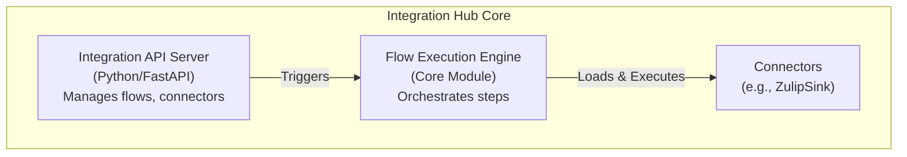

# Cross-Platform Integration Hub

## Overview

The Cross-Platform Integration Hub is a plug-and-play service for connecting your AI ecosystem to external APIs, databases, SaaS, and messaging platforms (such as Zulip, Teams, SAP, and more). It features a no-code/low-code interface, enabling rapid, secure integration with minimal effort.

## Current Status: Proof of Concept

This service is currently in the Proof-of-Concept (PoC) stage. The foundational API server is built, and a simple flow execution engine and a PoC Zulip connector have been implemented.

## Architecture

The current architecture is composed of a FastAPI-based API server, a simple core execution engine, and a system for dynamically loaded connectors.



## Getting Started

### Prerequisites

- Python 3.8+
- A Zulip account and a bot with API credentials.

### Installation

1.  **Clone the repository**
2.  **Install dependencies:**

    ```bash
    # Install main application dependencies
    pip install -r IntegrationHub/requirements.txt

    # Install development/testing dependencies
    pip install -r IntegrationHub/requirements-dev.txt
    ```

### Running the Service

The Integration Hub is powered by a FastAPI application.

1.  **Start the server:**

    ```bash
    uvicorn IntegrationHub.app.main:app --reload
    ```

2.  **Access the API documentation:**

    Once the server is running, you can access the interactive OpenAPI documentation at [http://127.0.0.1:8000/docs](http://127.0.0.1:8000/docs).

### Running Tests

The project uses `pytest` for testing.

```bash
python3 -m pytest IntegrationHub/tests/
```

## API Endpoints

The following API endpoints are available:

-   `POST /credentials/`: Create a new credential for storing secrets.
-   `GET /credentials/`: List all existing credentials (metadata only).
-   `POST /flows/`: Create a new integration flow.
-   `GET /flows/`: List all existing flows.
-   `GET /flows/{flow_id}`: Retrieve a specific flow.
-   `POST /flows/{flow_id}/trigger`: Manually trigger a flow execution.
-   `POST /hooks/{hook_id}`: Endpoint to receive external webhooks.
-   `GET /connectors/`: List all available connectors.

### Example: Triggering a Zulip Notification Flow

1.  **Create a Credential** to securely store your Zulip bot's API key and email. Send a `POST` request to `/credentials/` with the following body:

    ```json
    {
      "name": "My Zulip Bot",
      "type": "zulip_api_key",
      "secrets": {
        "email": "your-bot-email@example.com",
        "api_key": "YOUR_ZULIP_API_KEY",
        "site": "https://your-org.zulipchat.com"
      }
    }
    ```
    Note the `id` of the credential returned in the response. Let's say it's `cred-12345`.

2.  **Create a flow** by sending a `POST` request to `/flows/`. This flow references the credential by its ID, keeping secrets out of the flow definition.

    ```json
    {
      "name": "Send a Zulip Message",
      "trigger": {
        "type": "manual",
        "configuration": {}
      },
      "steps": [
        {
          "name": "Zulip Notifier",
          "connector_id": "zulip-message",
          "credential_id": "cred-12345",
          "configuration": {
            "stream": "your-stream-name",
            "topic": "your-topic-name",
            "content": "Hello from the Integration Hub!"
          }
        }
      ]
    }
    ```
    Note the `id` of the flow returned in the response.

3.  **Trigger the flow** by sending a `POST` request to `/flows/{flow_id}/trigger`, where `{flow_id}` is the ID you received in the previous step.

A message "Hello from the Integration Hub!" should appear in your configured Zulip stream and topic.

## Contributing

We welcome new connectors, integrations, and UI/UX improvements. See `CONTRIBUTING.md` for details.
