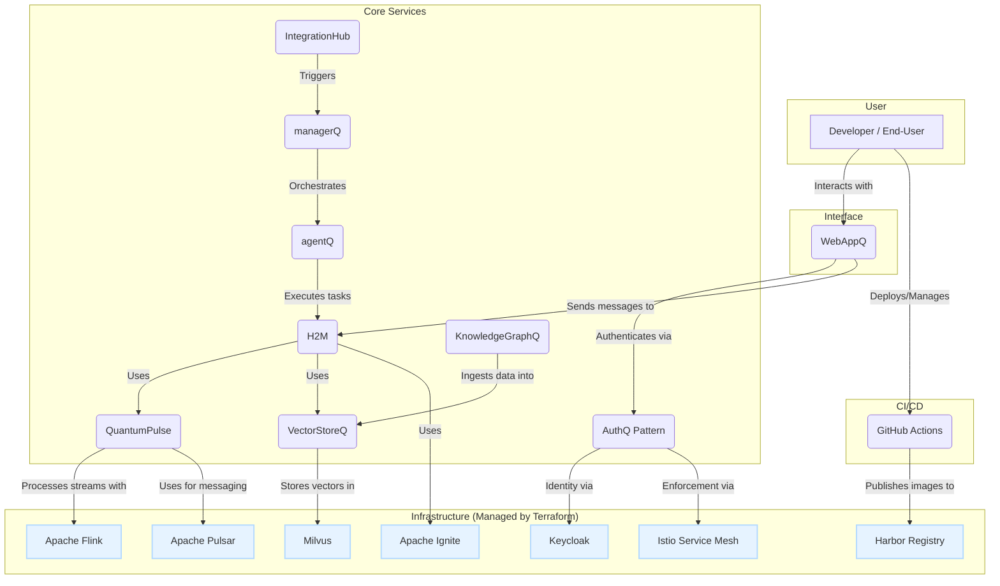

# 🚀 The Q Platform

The Q Platform is a comprehensive, scalable, and secure ecosystem for building and deploying next-generation AI-native applications. It provides a complete, end-to-end solution, from data ingestion and real-time processing to model inference and user-facing applications, all built on a foundation of industry-standard open-source components.

## 🏛️ Architecture Overview

The platform is designed as a distributed system of microservices, orchestrated by Kubernetes and secured by a service mesh. Each service has a distinct responsibility, enabling clear separation of concerns and independent development and scaling.

---

## 🚀 Getting Started

The entire platform's infrastructure can be deployed automatically using Terraform. For detailed instructions on setting up the Kubernetes cluster with Keycloak, Milvus, Harbor, and all necessary security policies, please see the infrastructure documentation.

➡️ **[Full Infrastructure Setup Guide](./infra/terraform/README.md)**

Once the infrastructure is deployed, you can run the services and the web application. The CI/CD pipelines are configured to automatically build and publish Docker images to the Harbor registry.

➡️ **[CI/CD Documentation](./CI-CD.md)**

---

## 📁 Services Directory

| Service | Description | README |
| --- | --- | --- |
| **`WebAppQ`** | The user-facing web application and chat interface. | [**`WebAppQ/README.md`**](./WebAppQ/README.md) |
| **`H2M`** | The central conversational AI orchestrator that manages user interactions. | [**`H2M/README.md`**](./H2M/README.md) |
| **`QuantumPulse`** | The next-generation service for distributed LLM inference pipelines. | [**`QuantumPulse/README.md`**](./QuantumPulse/README.md) |
| **`VectorStoreQ`** | The centralized service for managing and querying vector embeddings in Milvus. | [**`VectorStoreQ/README.md`**](./VectorStoreQ/README.md) |
| **`KnowledgeGraphQ`**| Responsible for batch data processing and ingestion into the vector store. | [**`KnowledgeGraphQ/README.md`**](./KnowledgeGraphQ/README.md) |
| **`AuthQ`** | The security pattern using Keycloak and Istio for platform-wide auth. | [**`AuthQ/README.md`**](./AuthQ/README.md) |
| **`IntegrationHub`** | A service for connecting to and synchronizing with external systems. | [**`IntegrationHub/README.md`**](./IntegrationHub/README.md) |
| **`agentQ`** | An autonomous agent for performing tasks. | [**`agentQ/README.md`**](./agentQ/README.md) |
| **`managerQ`** | A service for managing and coordinating multiple agents. | [**`managerQ/README.md`**](./managerQ/README.md) |
| **`infra/terraform`** | The Terraform project for deploying and managing all infrastructure. | [**`infra/terraform/README.md`**](./infra/terraform/README.md) |
| `UserProfileQ` | *Future Service*: Manages user profiles and preferences. | `UserProfileQ/README.md` |
| `ObservabilityStack`| *Future Service*: Will contain configurations for Prometheus, Grafana, etc. | `ObservabilityStack/README.md` |

## Proactive Agent Abilities

The platform now supports proactive, autonomous agent workflows orchestrated by `IntegrationHub`. These flows can be triggered on a schedule (e.g., via a cron job) to perform tasks like generating daily reports, monitoring data streams, or any other custom automation.

A prime example is the `post_daily_zulip_summary` flow, which automatically asks an agent to summarize a Zulip stream and posts the result to a digest channel. This showcases the power of combining the agent's intelligence with the platform's integration capabilities.

Refer to the `IntegrationHub/README.md` for more details on how to define and trigger these proactive flows.
